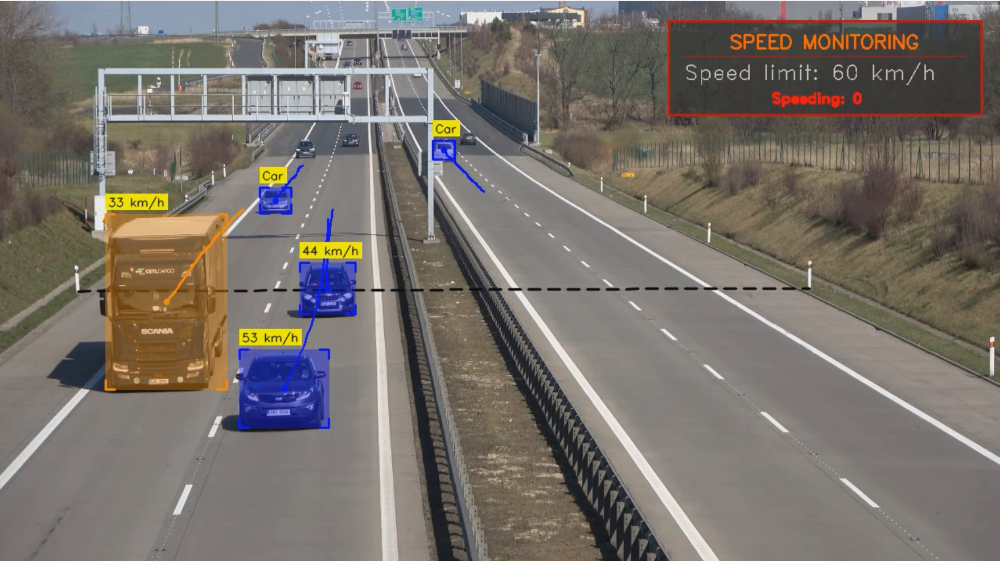

# Vehicle Speed Estimation with YOLOv10 

This project implements a vehicle speed estimation system using the YOLOv10 object detection model and OpenCV for video processing. It detects vehicles (Cars, buses, and trucks), tracks their movement across a predefined line, estimates their speed, and flags speeding violations based on a set speed limit. The output is an annotated video with bounding boxes, speed information, and a monitoring panel.



## Features
- Detects and tracks vehicles (classes: car, truck ,bus) using YOLOv10.
- Estimates vehicle speed by tracking movement across two reference points.
- Displays a speed monitoring panel with the speed limit and speeding violation count.
- Saves the annotated video with bounding boxes, trajectories, and speed information.
- Optional mouse coordinate display for debugging reference points.
- Supports GPU acceleration with PyTorch (CUDA) if available.

## Prerequisites
- Python 3.8 or higher
- CUDA-enabled GPU (optional, for faster inference with YOLOv10)
- Input video file (`speed.mp4`) in the project directory
- Pre-trained YOLOv10 model weights (`yolov10n.pt`) in the `models/` directory

## Installation
1. Clone this repository:

   ```bash
   git clone https://github.com/Wassimhfaiedh/Vehicle-Speed-Estimation-with-YOLOv10.git
   cd Vehicle-Speed-Estimation-with-YOLOv10
2. Install the required dependencies:

   ```
   pip install -r requirements.txt
   
   ```
3. Ensure the YOLOv10 model weights (yolov10n.pt) are placed in the models/ directory.
4. Place the input video (speed.mp4) in the project directory.

## Usage
1. Run the main script:

```
python main.py

```

2. The script will: 

-  Load the video **(speed.mp4)** and process it frame by frame.
- Detect and track vehicles **(cars and trucks and buses )** using YOLOv10.
- Estimate vehicle speeds and flag speeding violations (default speed limit: **60 km/h**).
- Display the processed video with annotations in a window named "RGB".
- Save the annotated video as **output_annotated.mp4**.
3. Press **'q'** to exit the video display.


